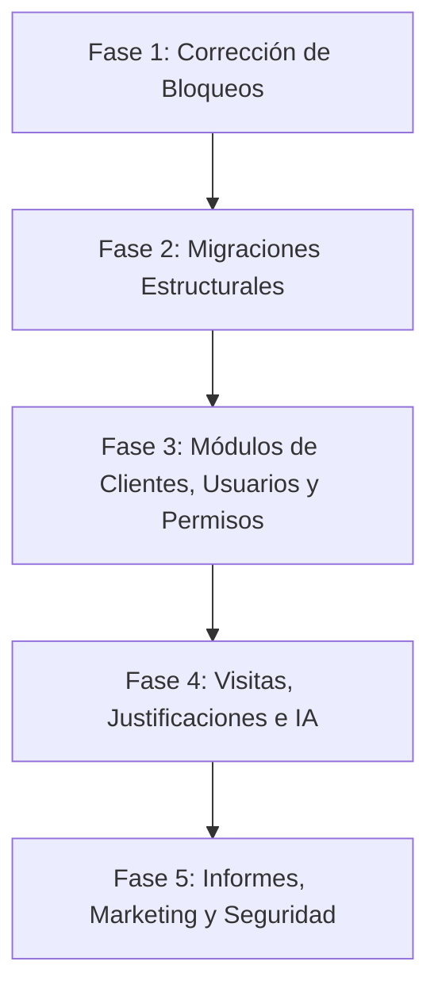

# Plan de Desarrollo y Hoja de Ruta: Plataforma Kaizen (Actualizado)

Este documento detalla el plan de acción, requerimientos de negocio y hoja de ruta de la plataforma **Kaizen Ophtha**. 

---

## 👥 Roles y Contactos del Proyecto
*   **Tatiana Aguirre:** Directora de Mercadeo.
*   **Jhoana Londoño:** Analista de mercadeo y supervisora encargada de Kaizen (validadora de entregables).
*   **Juan David:** Encargado de sistemas de la compañía.
*   **Enlace de Producción:** [kaizenophtha.com](https://kaizenophtha.com/)

---

## 🗺️ Fases del Desarrollo y Orden de Prioridad

---

## 📑 Paso a Paso Detallado por Fases

### 🛠️ FASE 1: Corrección de Bloqueos Críticos (Completado)
*   **Objetivo:** Solucionar errores que impiden el flujo operativo básico.
*   **Tareas:**
    1. **Corregir el bug de pantalla negra al iniciar sesión como Representante:** Mapeo de rutas y layouts correspondientes en la plantilla del frontend para que el rol Representante ingrese sin problemas al dashboard.

---

### 🗄️ FASE 2: Migraciones Estructurales (Completado y Verificado)
*   **Objetivo:** Adaptar el backend y la base de datos a las especificaciones tecnológicas finales.
*   **Tareas:**
    1. **Migración a PostgreSQL:** Configurar Sequelize e instalar dependencias (`pg`, `pg-hstore`) para migrar la base de datos de MySQL a PostgreSQL.
    2. **Reescritura del Backend a TypeScript:** Inicialización de `tsconfig.json` y migración de todos los archivos `.js` a `.ts` con tipado estático completo. Verificación de compilación exitosa (`npm run build`).

---

### 👥 FASE 3: Módulo de Paneles (Clientes), Usuarios y Gestión de Permisos (Siguiente Fase)
*   **Objetivo:** Reestructurar la asignación de clientes, configurar la gestión modular de accesos e implementar el almacenamiento de Habeas Data.
*   **Tareas:**
    1. **Gestión de Paneles Multiasesor:**
       - Modificar la relación en base de datos para que un mismo Panel (cliente) pueda ser gestionado por varios asesores comerciales (relación Muchos a Muchos a través de una tabla intermedia).
       - Desaparecer la pestaña/vista independiente de **"Portafolio"** del menú y unificar todo bajo la sección de **"Paneles"**.
    2. **Zona de Usuarios y Control de Sesiones:**
       - Permitir la creación, edición y eliminación de usuarios desde la sección administrativa.
       - Llevar un **registro de auditoría (logs de inicio de sesión):** guardar inicios de sesión, cambios realizados en la base de datos y duración de cada sesión. Estos logs deben ser exportables a Excel.
       - Configurar recordatorios automáticos por email para recordar a los asesores que deben ingresar a la plataforma cada cierto tiempo.
    3. **Gestión Granular de Permisos:**
       - Crear una zona de gestión de permisos modulares en el sistema (Ver, Editar, Eliminar) para configurar a qué secciones y acciones específicas tiene acceso cada tipo de usuario.
    4. **Importación Masiva de Paneles y Formulario:**
       - Reparar el importador Excel en la pestaña "Importar" para soportar subidas masivas de paneles clasificando por tipología (**Médico, Droguería, Comercial**). Opción exclusiva para Administradores.
       - Revisar y optimizar el formulario de actualización (Update) de paneles asegurando una correcta redirección al listado principal. La eliminación de paneles estará disponible únicamente para administradores.
    5. **Integración con Amazon S3 e Habeas Data:**
       - Configurar AWS SDK e implementar el campo en el formulario de paneles para subir el Habeas Data escaneado directamente a Amazon S3.
       - **Caso de Estudio:** Analizar y diseñar un canvas en línea en la plataforma para permitir la firma digital del Habeas Data directamente en la pantalla.
    6. **Buscador Avanzado e Indicadores:**
       - Ampliar el buscador de paneles para permitir búsquedas cruzadas por 3 o más campos simultáneamente (Cédula, Nombre, Apellido, Especialidad, etc.).
       - Permitir la exportación a Excel del listado filtrado por el buscador.
       - Agregar widgets que muestren contadores de valores clave (ej. total de optómetras en el sistema, cantidad de médicos por ciudad, etc.).
       - Garantizar el soporte de caracteres especiales (Unicode/UTF-8) en toda la aplicación.
    7. **Estructura Geográfica:**
       - Implementar el listado oficial de departamentos (**Región**), países y ciudades en los formularios de la plataforma según la información provista por Ophtha.

---

### 📅 FASE 4: Módulo Unificado de Visitas y Justificaciones, Planes de Trabajo e IA
*   **Objetivo:** Registrar visitas, controlar de forma automatizada las justificaciones e integrar transcripción por voz.
*   **Tareas:**
    1. **Unificación de Visitas y Justificaciones:**
       - Consolidar visitas y justificaciones en un único módulo operativo.
       - **Lógica de Impactos:** El campo "impacto" de los paneles indica cuántas visitas mensuales requiere ese cliente. Cada visita médica registrada deduce el contador de impactos pendientes del asesor comercial.
       - **Justificaciones:** Al cierre de mes, los impactos pendientes de visitar se traspasan de forma automática a la bandeja de "Justificaciones", donde el asesor debe ingresar el motivo del no cumplimiento.
    2. **Visibilidad de Visitas y Reportes:**
       - El Representante solo puede visualizar sus propias visitas registradas.
       - El rol Administrativo y el de Coordinador pueden visualizar las visitas de todos los asesores, filtrar por representante o rango de fechas, y exportar a Excel.
       - Habilitar la búsqueda de visitas por cédula, nombre y apellido del panel.
       - **Cierre de Mes Automatizado:** Bloquear las visitas del mes en curso para que no puedan ser alteradas una vez vencido el periodo.
    3. **Plan de Trabajo Semanal:**
       - Módulo que permite a los representantes documentar día a día sus planes comerciales e inasistencias.
       - Permitir filtrar y exportar los planes de trabajo a Excel únicamente a los roles de Administrador y Coordinador.
    4. **Integración de IA (OpenAI Whisper):**
       - Integrar un servicio de transcripción de voz a texto por medio de Whisper para que el representante dicte su plan de trabajo semanal y se autocomplete la bitácora en texto.

---

### 📊 FASE 5: Informes (Reportes), Home con KPIs, Marketing y Seguridad
*   **Objetivo:** Habilitar cruces de datos avanzados, notificaciones automáticas de cumpleaños y seguridad general.
*   **Tareas:**
    1. **Módulo de Informes (Renombrado de "Reportes"):**
       - Generar el cruce de visitas realizadas frente a los impactos acordados para calcular el porcentaje (%) de cumplimiento de cada asesor y panel.
       - **Caso de Análisis (Informes a Mano Alzada):** Diseñar un sistema de reportes dinámico en el cual el administrador pueda cruzar datos de diferentes tablas de forma personalizada para obtener un único informe a la medida.
    2. **Home (Dashboard de KPIs):**
       - Rediseñar los indicadores del Home aplicando filtros avanzados de KPIs.
       - **Visibilidad según Rol:**
         - El Representante ve únicamente sus métricas personales.
         - El Administrador ve el consolidado global y el rendimiento individual de cada asesor.
         - El **Coordinador** ve únicamente la sumatoria o total de los indicadores de los asesores que están bajo su cargo.
    3. **Marketing & Amazon SES (Cumpleaños):**
       - Automatizar el envío de felicitaciones de cumpleaños a los médicos mediante Amazon SES.
       - Enviar recordatorios automáticos a los asesores comerciales con días de anticipación sobre los próximos cumpleaños de los médicos asignados en sus paneles.
    4. **Calendario Unificado:**
       - Consolidar en un solo calendario interactivo los planes de trabajo semanales, visitas médicas programadas y fechas de cumpleaños de los médicos.
    5. **Seguridad y Auditoría:**
       - Implementar Doble Factor de Autenticación (2FA) para el acceso seguro.
       - Realizar una auditoría de seguridad general de la aplicación contra hackers, inyecciones de código y vulnerabilidades de librerías obsoletas.
